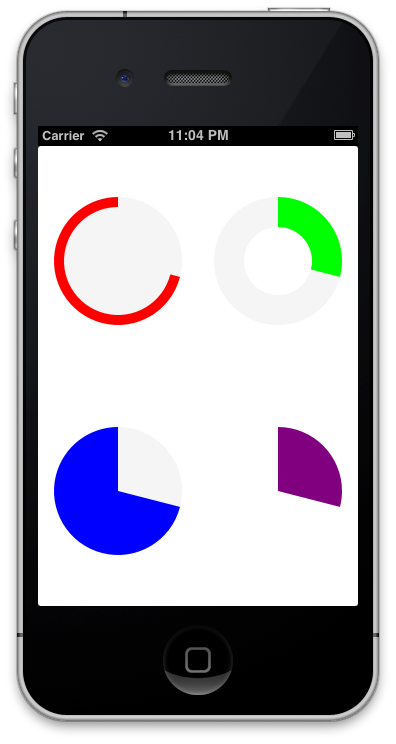

# THCircularProgressView

`THCircularProgressView` is a `UIView` subclass with a circular bar useful for illustrating progress.



## Installation

Drag the contents of `THCircularProgressView/` into your project.

## Usage

`THCircularProgressView` is simply a `UIView` subclass so just instantiate it and add it a view hieararchy. The initializer is:

```objc
- (instancetype)initWithCenter:(CGPoint)center
              radius:(CGFloat)radius
           lineWidth:(CGFloat)lineWidth
        progressMode:(THProgressMode)progressMode
       progressColor:(UIColor *)progressColor
progressBackgroundMode:(THProgressBackgroundMode)backgroundMode
progressBackgroundColor:(UIColor *)progressBackgroundColor
          percentage:(CGFloat)percentage
```

You can also use the standard `-[UIView initWithFrame:(CGRect)frame]`.

It supports two kinds of progress mode:
* `THProgressModeFill` - starts empty and gets filled as percentage increases; (default)
* `THProgressModeDeplete` - starts full and depletes as percentage increases;

There is also a label that can be set to display the number the progress view represents. For example:

```objc
THCircularProgressView *progress = ...;
CGFloat percentage = 0.3f;
progress.centerLabel.text = [NSString stringWithFormat:@"%.0f", percentage * 100.0f];
progress.centerLabelVisible = YES; // needed since label is invisible by default
```

The sample project in `/Demo` contains some examples.

## License

THCircularProgressView is available under the MIT license. See the LICENSE file for more info.
